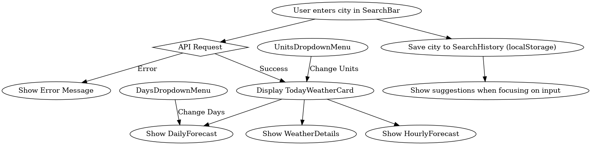

# 🌤️ Weather Now

A modern, responsive **React** weather application that allows users to search for any city and view real-time weather data. It includes accurate forecasts, error handling, search history, and a smooth user experience with keyboard accessibility.

---

## 🚀 Features

- **Search Weather by City**

Enter any city name and get live weather updates instantly.

- **Error Handling**

- Invalid city → `No search results found`.

- API error → `Something went wrong, please try again later`.

- **Search History**

Saves the last 5 searched cities in **localStorage** and shows them as suggestions when focusing on the input.

- **Keyboard Accessibility**

- Navigate results with `Tab`.

- Press `Enter` to select a focused item.

- Focus outlines only appear with keyboard (`:focus-visible`).

- **Responsive UI**

Optimized layout for desktop and mobile devices.

- **Unit System Toggle**

Switch easily between **Metric (°C, km/h)** and **Imperial (°F, mph)**.

---

## 🛠️ Technologies Used

- **React (Hooks, useState, useEffect)**

- **CSS (custom styles + focus-visible accessibility)**

- **Open-Meteo API** for weather & geocoding

- **LocalStorage** for storing search history

---

## 🔧 Technical Details

- **Frontend Framework:** React.js
- **Styling:** CSS (with responsive design)
- **State Management:** React hooks (`useState`, `useEffect`)
- **API Integration:** OpenWeatherMap API (for current, hourly, and daily forecast data)
- **Features Implemented:**

  - Search for cities with API calls.
  - Search history stored in **localStorage**.
  - Error handling for invalid city names and API failures.
  - Dropdown menu for switching between **units (°C / °F)**.
  - Dropdown menu for selecting number of forecast days.
  - Auto-focus outline only visible with **keyboard navigation** (better accessibility).

---

## 📂 Project Structure

src/
├── components/
│ ├── DailyForecast.js # Displays daily weather forecast
│ ├── DaysDropdownMenu.js # Dropdown for choosing forecast days
│ ├── Header.js # Top navigation/header
│ ├── HourlyForecast.js # Displays hourly weather forecast
│ ├── SearchBar.js # Input field for city search
│ ├── SearchHistory.js # Shows previously searched cities
│ ├── SearchInProgress.js # Loading indicator for ongoing searches
│ ├── TodayWeatherCard.js # Displays today's weather
│ ├── UnitsDropdownMenu.js # Dropdown for units (Celsius / Fahrenheit)
│ ├── WeatherDetails.js # Extra details (humidity, wind, etc.)
│
├── App.js # Main application wrapper
├── index.css # Global styling
├── index.js # Entry point

---

## 📊 Work Flow Chart

## ▶️ Getting Started

### 1. Clone the repository

`git clone https://github.com:RamezKhaled77/React-Weather-App.git`

### 2. Navigate into the project

`cd React-Weather-App`

### 3. Install dependencies

`npm install`

### 4. Run the project

`npm start`

The app will run on [http://localhost:3000](http://localhost:3000).

---

## 🧪 Testing the App

- ✅ Type a **valid city name** → should return weather info.

- ❌ Type an **invalid city name** → should display `No search results found`.

- 🔌 Simulate **API error** (disable internet or change API URL) → should display error page.

- ⌨️ Use `Tab` + `Enter` → full keyboard accessibility.

- 📜 Search a few cities → reopen app and see them in search history.

---

## 🔮 Future Improvements

- Add **multi-language support**

- Add **dark/light mode switch**

- Add **location-based auto-detection**
